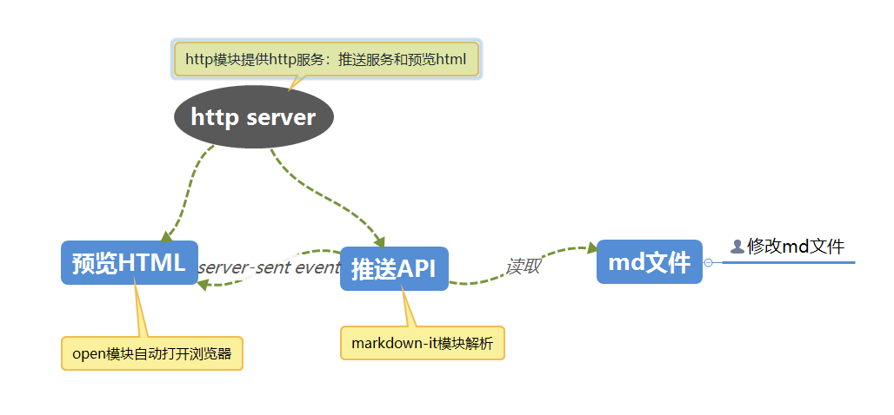

# node-markdown-preview
node实现markdown实时预览[热加载]，自动打开浏览器。

# how to start
npm install

# how to use
### node index.js [mdfile] [port]
    mdfile: 指定md文件, 必选
    port: 服务端口, 可选, 默认8888

# 实现
* http模块提供推送服务和页面预览服务
* 页面预览效果借鉴webpack的热加载，无需刷新，即使用[HTML5 服务器发送事件（server-sent event）](http://www.w3school.com.cn/html5/html_5_serversentevents.asp)。当然也可以用websocket实现，但websocket是双向传输，相对较重。而SSE是单向传输(服务器向浏览器传输)，很轻巧，和markdown预览可以说配合的相得益彰了。
* markdown解析使用[markdown-it](https://github.com/markdown-it/markdown-it#readme)实现
* 自动打开浏览器使用[opn](https://github.com/sindresorhus/opn#readme)实现,封装了不同操作系统的调用浏览器命令的姿势

# 图解

### 效果
### 1 自动启动打开浏览器

### 2 [热加载]实时预览

