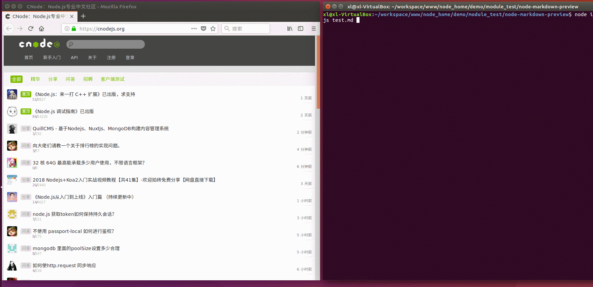
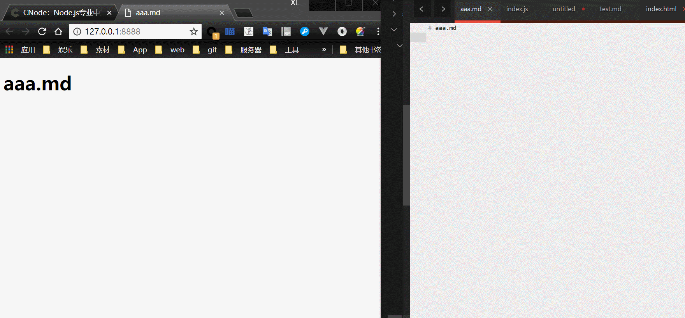

# node-markdown-preview
node实现markdown实时预览[热加载]

# how to start
npm install

# how to use
### node index.js [mdfile] [port]
    mdfile: 指定md文件, 必选
    port: 服务端口, 可选, 默认8888

### 效果
### 1 自动启动打开浏览器

### 2 [热加载]实时预览

